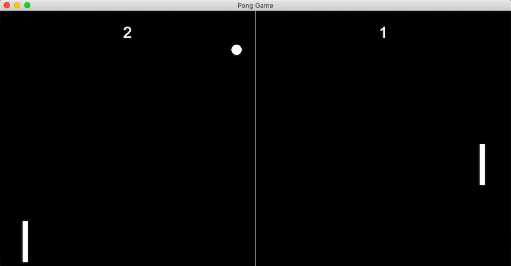
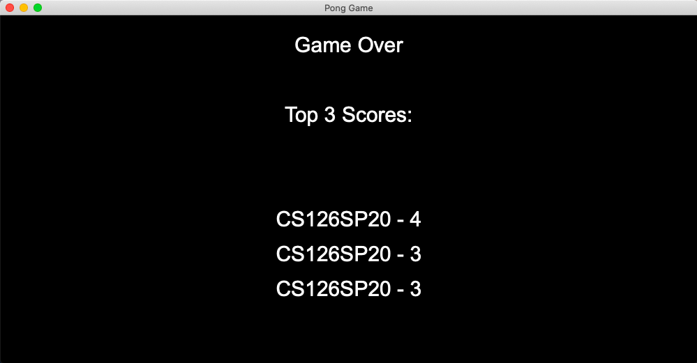

# Final Project - Ping Pong Game

**Author**: Viola Zhao - [`violaz2@illinois.edu`](mailto:example@illinois.edu)

# Ping Pong

## Dependencies

- [cmake](https://cmake.org/)
- [cinder](https://libcinder.org/download)
- [SQLiteModernCPP + SQLite3](https://www.sqlite.org/index.html)
- [gflags](https://github.com/gflags/gflags)
- [PretzelGUI](https://github.com/cwhitney/PretzelGui)

## Controls

### Game

#### How To Play

Move paddles 1 and 2 up and down to hit the ball. If the paddle hits the ball, the score will increase by one. If the paddle misses the ball and the ball hits either the left or right side of the screen, the game is over and the highest 3 scores are displayed.

#### Keyboard

| Key       | Action                                                      |
|---------- |-------------------------------------------------------------|
| `UP`       | Paddle 1 moves up                                           |
| `DOWN`       | Paddle 1 moves down                                            |
| `w` | Paddle 2 moves up                                                        |
| `s`       | Paddle 2 moves down                                          |
